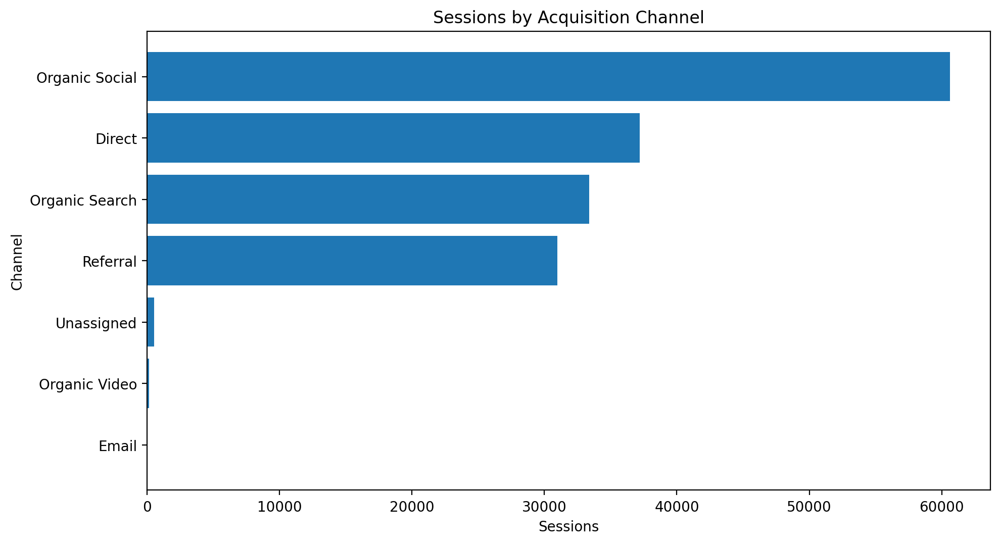
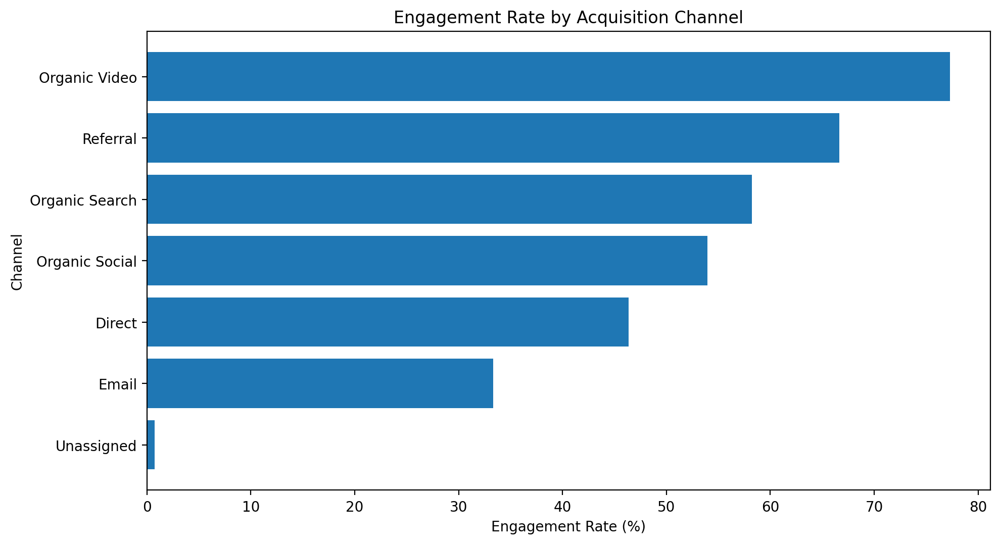
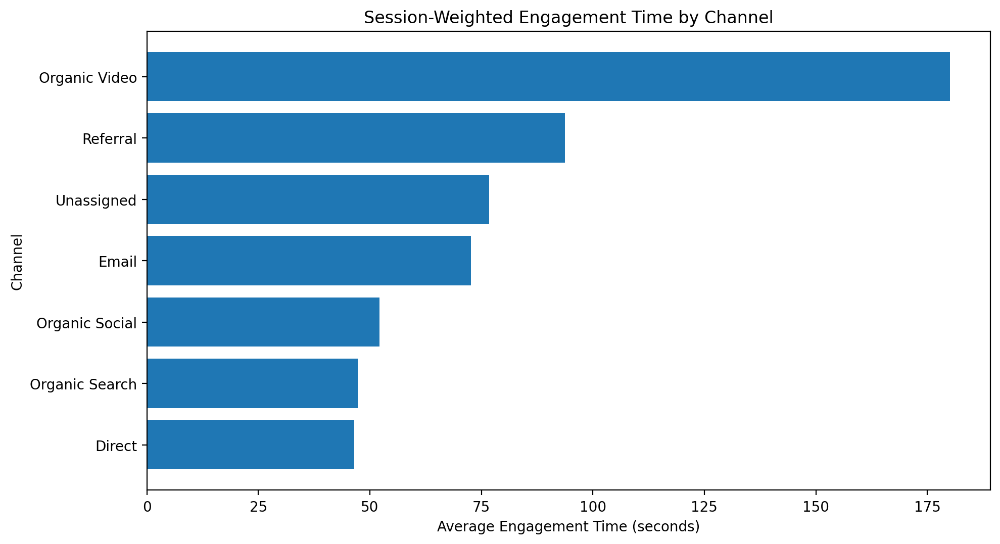
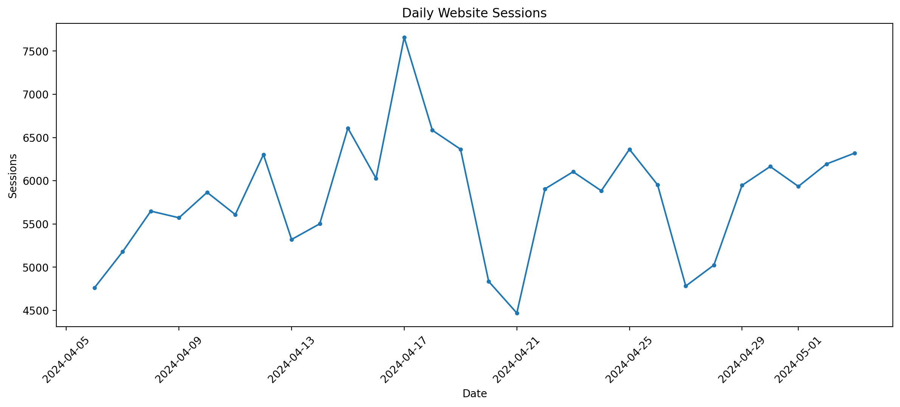
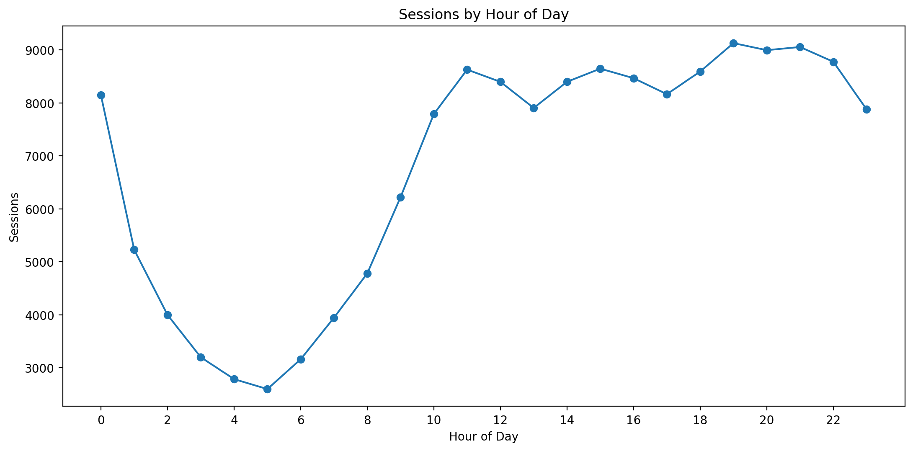
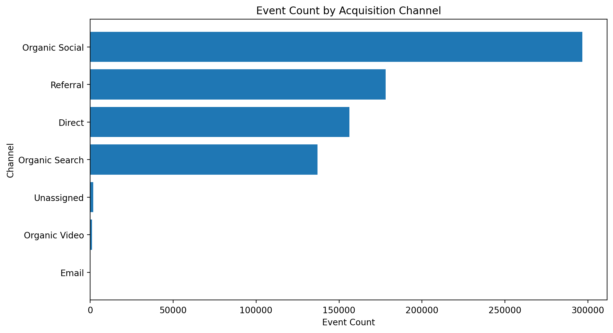
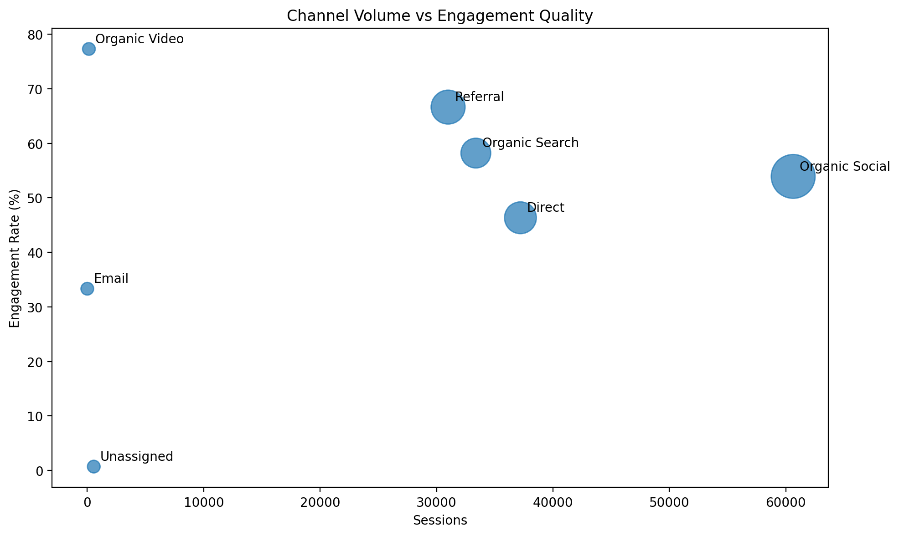
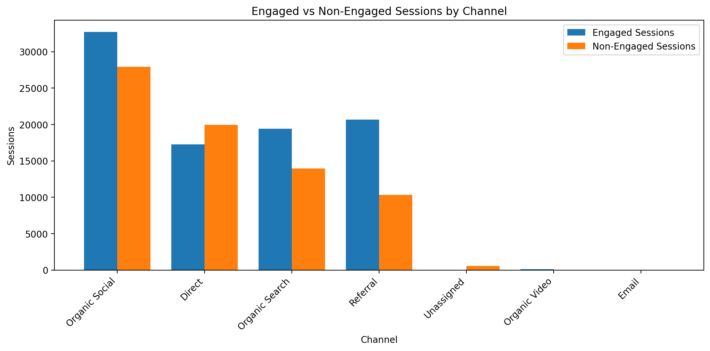

# Web Analytics — Traffic & Engagement Analysis

## Project Overview

This project analyzes website traffic and user engagement data to understand how different acquisition channels perform and where there may be opportunities to improve website engagement.

The analysis focuses on traffic volume, engagement quality, event activity, and traffic patterns across channels and time periods.

The project uses Python and Pandas for data cleaning, KPI calculation, aggregation, exploratory analysis, and visualization.

---

## Business Problem

Website traffic alone does not indicate whether users are meaningfully engaging with a website.

The objective of this analysis is to answer:

- Which acquisition channels generate the most sessions?
- Which channels have the strongest engagement?
- Which channels generate the most event activity?
- Which channels have longer engagement times?
- Which high-volume channels have below-average engagement?
- How does website traffic change over time?
- Which hours receive the highest traffic?
- Where are potential engagement improvement opportunities?

---

## Objectives

1. Clean and validate the web analytics dataset.
2. Analyze website traffic by acquisition channel.
3. Measure engagement quality across channels.
4. Calculate key website performance KPIs.
5. Analyze daily and hourly traffic patterns.
6. Compare engaged and non-engaged sessions.
7. Identify high-volume channels with below-average engagement.
8. Translate analytical findings into practical business recommendations.

---

## Dataset

The dataset contains:

- Channel group
- Date and hour
- Users
- Sessions
- Engaged sessions
- Average engagement time per session
- Engaged sessions per user
- Events per session
- Engagement rate
- Event count

Dataset path:

`data/cleaned_web_data.csv`

---

## Key KPIs

| KPI | Definition |
|---|---|
| **Total Sessions** | Total number of website sessions |
| **Engaged Sessions** | Total sessions classified as engaged |
| **Engagement Rate** | Engaged sessions ÷ total sessions |
| **Total Events** | Total recorded events |
| **Events per Session** | Total events ÷ total sessions |
| **Session-Weighted Avg. Engagement Time** | Engagement time weighted by session volume |
| **Non-Engaged Sessions** | Total sessions − engaged sessions |
| **Session Share** | Channel sessions ÷ total sessions |
| **Peak Traffic Hour** | Hour with the highest session volume |

---

## Business Questions

### Traffic Performance

- Which channels generate the highest number of sessions?
- What proportion of total sessions does each channel contribute?
- Which channels are responsible for the largest share of website traffic?

### Engagement Performance

- Which channels have the highest engagement rate?
- Which channels have the highest session-weighted engagement time?
- How many sessions are engaged versus non-engaged?

### Event Activity

- Which channels generate the most events?
- How many events are generated per session?
- Do high-traffic channels also demonstrate strong event activity?

### Time-Based Analysis

- How does traffic change from day to day?
- Which hours generate the highest session volume?
- Are there identifiable periods of higher website activity?

### Business Opportunities

- Which high-volume channels have below-average engagement?
- Which channels combine strong traffic with strong engagement?
- Which lower-volume channels demonstrate relatively strong engagement and may have growth potential?

---

## Analysis Methodology

```text
Raw Web Analytics Data
        ↓
Data Cleaning & Validation
        ↓
Column Standardization
        ↓
KPI Calculation
        ↓
Channel-Level Aggregation
        ↓
Daily & Hourly Analysis
        ↓
Channel Performance Analysis
        ↓
Business Opportunity Identification
        ↓
Insights & Recommendations
```

---

## Data Preparation

The notebook:

- Removes unnecessary index columns.
- Standardizes column names.
- Converts numerical fields to numeric data types.
- Converts `Datehour` to datetime.
- Creates separate date and hour fields.
- Checks missing values.
- Checks duplicate records.
- Validates essential fields.
- Removes invalid rows where required.

Column standardization includes:

- `Session` → `Sessions`
- `Engaged Session` → `Engaged sessions`
- `Average engagement time per session` → `Avg engagement time`
- `Engaged session per user` → `Engaged sessions per user`

---

## Channel Performance Analysis

The project creates a channel-level performance table containing:

- Sessions
- Engaged Sessions
- Events
- Engagement Rate
- Events per Session
- Weighted Average Engagement Time
- Non-Engaged Sessions
- Session Share

This allows acquisition channels to be compared using both traffic volume and engagement quality.

---

## Channel Opportunity Analysis

The notebook identifies channels that have:

- At least median-level session volume
- Below-average engagement rate

These channels attract meaningful traffic but may have room for engagement improvement.

Potential areas for investigation include:

- Landing-page relevance
- Audience targeting
- Content alignment
- User experience
- Traffic quality

---

# Visual Analysis

## 1. Sessions by Acquisition Channel



## 2. Engagement Rate by Acquisition Channel



## 3. Session-Weighted Engagement Time



## 4. Daily Website Sessions



## 5. Sessions by Hour



## 6. Event Activity by Channel



## 7. Traffic Volume vs Engagement Quality



## 8. Engaged vs Non-Engaged Sessions



---

# Business Insights

The notebook is designed to identify:

### Traffic Concentration
Channels contributing the largest share of website sessions.

### Engagement Quality
Whether high traffic is accompanied by meaningful engagement.

### Channel Opportunities
High-volume channels with below-average engagement that may require optimization.

### Timing Opportunities
Days and hours with higher traffic volumes that can support planning and monitoring.

> **Important:** Specific numerical findings should be taken from the executed notebook output because the analysis is based on the supplied dataset.

---

# Business Recommendations

### 1. Monitor High-Volume Channels

Monitor high-traffic channels using both traffic volume and engagement quality.

### 2. Investigate High-Volume, Low-Engagement Channels

Investigate landing-page relevance, audience targeting, content quality, user experience, and traffic quality.

### 3. Study High-Engagement Channels

Examine strong-engagement channels for patterns that may be transferable to other acquisition channels.

### 4. Use Traffic Timing for Planning

Peak traffic periods can inform content publishing, campaign scheduling, website monitoring, and resource planning.

### 5. Balance Volume and Quality

Evaluate channel performance using:

**Traffic Volume + Engagement Quality**

rather than relying only on session counts.

---

# Tools & Technologies

- Python
- Pandas
- NumPy
- Matplotlib
- Jupyter Notebook
- GitHub

---

# Project Structure

```text
Web_Analytics/
│
├── data/
│   └── cleaned_web_data.csv
│
├── images/
│   ├── 01_sessions_by_channel.png
│   ├── 02_engagement_rate_by_channel.png
│   ├── 03_engagement_time_by_channel.png
│   ├── 04_daily_sessions_trend.png
│   ├── 05_sessions_by_hour.png
│   ├── 06_event_activity_by_channel.png
│   ├── 07_volume_vs_engagement_quality.png
│   └── 08_engaged_vs_non_engaged_sessions.png
│
├── notebook/
│   └── web_data_analysis.ipynb
│
├── README.md
└── requirements.txt
```

---

# How to Run the Project

### 1. Clone the repository

```bash
git clone https://github.com/yatijaiswal435-collab/Web_Analytics.git
```

### 2. Navigate into the project

```bash
cd Web_Analytics
```

### 3. Install the required libraries

```bash
pip install -r requirements.txt
```

### 4. Open the notebook

Open `notebook/web_data_analysis.ipynb` using Jupyter Notebook, JupyterLab, or VS Code.

### 5. Run the notebook

Run the notebook from the first cell through the final cell.

The notebook will perform the analysis and generate the eight visualization files inside the `images/` directory.

---

# Limitations

This analysis is focused on website traffic and engagement.

The dataset does not contain information required to calculate:

- Revenue
- Marketing spend
- Return on Investment (ROI)
- Customer Acquisition Cost (CAC)
- Customer Lifetime Value (CLV)
- Profit
- Conversion value

Therefore, the project does **not** make claims about revenue or ROI.

Additional limitations:

- User counts should not be treated as simple additive unique-user totals across multiple time/channel records.
- Engagement rate is calculated as total engaged sessions divided by total sessions.
- Engagement time is session-weighted to account for differences in session volume across rows.

---

# Conclusion

This project demonstrates how web analytics data can be transformed into actionable business insights using Python.

The analysis evaluates:

**Traffic → Engagement → Channel Performance → Timing → Business Opportunities**

It demonstrates practical data-analyst skills in data cleaning, KPI development, aggregation, visualization, and business interpretation.

---

## Author

**Yati Jaiswal**

Aspiring Data Analyst | Python | SQL | Excel | Power BI

GitHub: https://github.com/yatijaiswal435-collab
